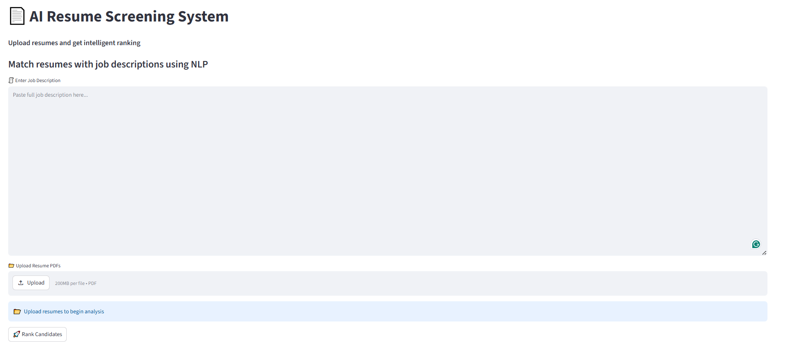
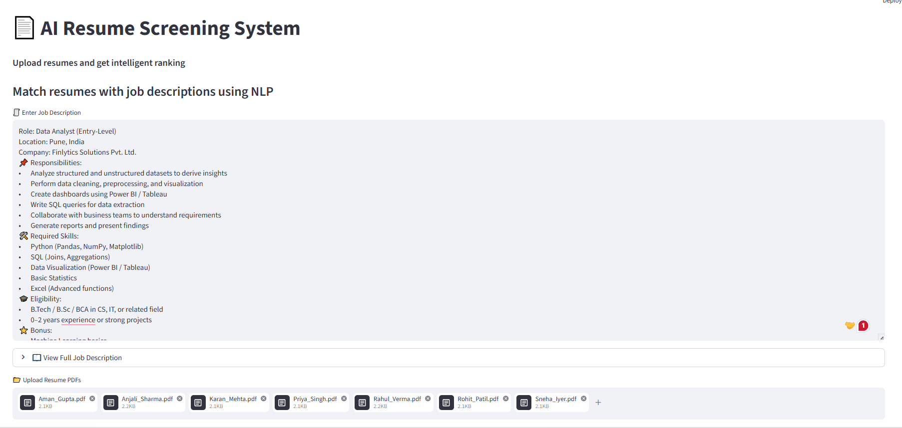
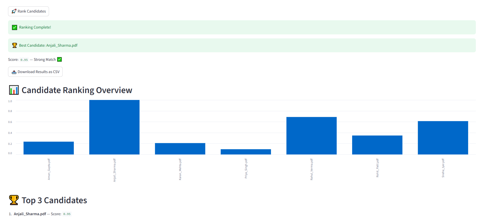
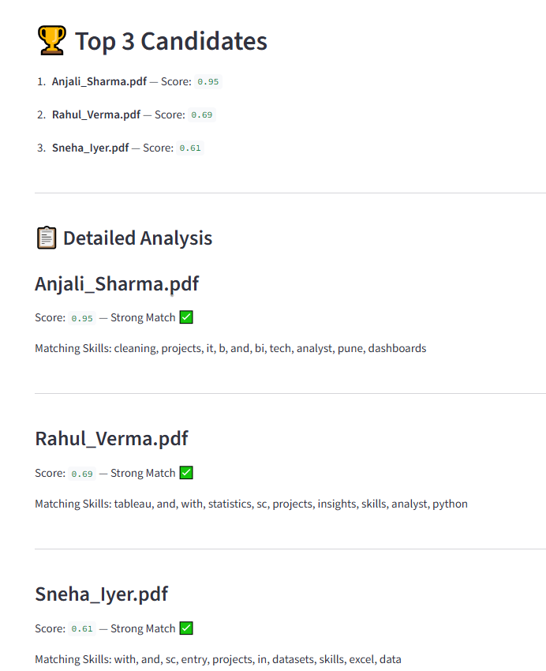
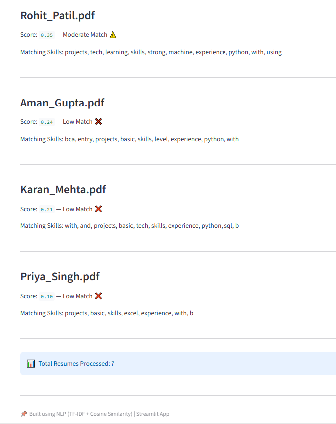

# 📄 AI Resume Screening System

## 🚀 Overview

An AI-powered web application that screens and ranks resumes based on their similarity to a given job description using Natural Language Processing (NLP).

This system helps recruiters quickly identify the most relevant candidates by analyzing resume content and matching it with job requirements.

---

## 🌐 Live Demo

👉 [Click here to try the app](https://resume-screening-system-ejcw8zcwu2vokq9djhufzs.streamlit.app/)

---

🔥 Key Highlights
* Designed a lightweight NLP-based ranking system without heavy deep learning models (fast & efficient)
* Built an end-to-end pipeline from PDF parsing → text processing → ranking → UI visualization
* Implemented explainable AI using keyword matching between job description and resumes
* Focused on clean UI/UX for real-world usability

---

## ✨ Features

* 📂 Upload multiple resumes (PDF format)
* 🧠 NLP-based ranking using TF-IDF & cosine similarity
* 📊 Visual ranking with bar charts
* 🏆 Top candidate identification
* 🔍 Keyword matching for explainability
* 📥 Download results as CSV
* ⚡ Clean and interactive UI

---

## 🧠 Tech Stack

* Python
* Streamlit
* Scikit-learn
* PyPDF2
* Pandas

---

## ⚙️ How It Works

1. Extract text from uploaded PDF resumes
2. Clean and preprocess text data
3. Convert text into numerical vectors using TF-IDF
4. Compute similarity using cosine similarity
5. Rank candidates based on similarity scores
6. Display results with insights and visualizations

---

## 📸 Screenshots

### 1. Main Interface

Clean and minimal UI for entering job description and uploading resumes.

### 2. Job Description Input

Supports full-length job descriptions with expandable view.

### 3. Resume Upload

Upload multiple candidate resumes in PDF format.


### 4. Ranking Results

Displays ranked candidates based on similarity scores.

### 5. Detailed Analysis

Shows keyword matches and detailed evaluation for each resume.

---

## 📂 Sample Input

Example resumes are provided in the `sample_resumes/` folder for testing.

⚠️ Note: All resumes included are dummy samples created for demonstration purposes only. They do not represent real individuals or personal data.

You can also upload your own PDF resumes.

---

## 📊 Example Output

|    Resume Name    | Score |    Match Level      |  
| ----------------- | ----- |------------------   |
| Anjali_Sharma.pdf | 0.82  | Strong Match ✅    | 
| Rahul_Verma.pdf   | 0.55  | Strong Match ✅    |
| Sneha_Iyer.pdf    | 0.21  | Strong Match ✅    |
| Rohit_Patil.pdf   | 0.21  | Moderate Match ⚠️  |
| Aman_Gupta.pdf    | 0.21  | Low Match ❌       |
| Karan_Mehta.pdf   | 0.21  | Low Match ❌       |
| Priya_singh.pdf   | 0.21  | Low Match ❌       |
---

## 📁 Project Structure

```
resume-screening-system/
│
├── app.py              # Streamlit UI
├── utils.py            # Core NLP logic
├── requirements.txt    # Dependencies
├── README.md
├── screenshot1.png
├── screenshot2.png
├── screenshot3.png
├── screenshot4.png
├── screenshot5.png
└── sample_resumes/
```

---

## 🧑‍💻 How to Use

1. Enter job description
2. Upload resumes (PDF format)
3. Click "Rank Candidates"
4. View ranked results and insights
5. Download results as CSV

---

## ▶️ Run Locally

```bash
git clone https://github.com/<your-username>/resume-screening-system.git
cd resume-screening-system
pip install -r requirements.txt
streamlit run app.py
```

---

## 🔮 Future Improvements

* 🔥 BERT-based semantic matching
* 🧩 Skill extraction & classification
* 📈 Resume scoring breakdown
* ☁️ Deployment on cloud platforms

---

## 💡 Key Learnings

* Applied NLP techniques to a real-world use case
* Built an end-to-end pipeline (input → processing → UI)
* Improved user experience with clean UI and feedback
* Implemented explainable AI using keyword matching

---

## 📌 Author

**Dipal Patil**
